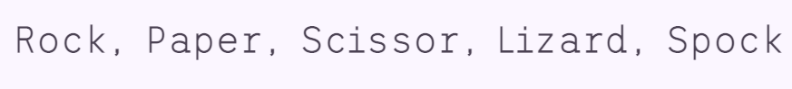
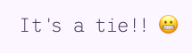
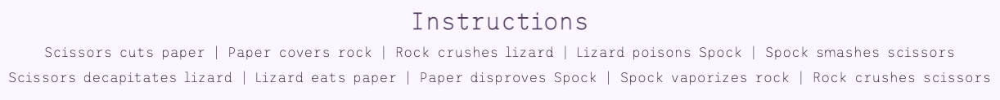

# Rock, Paper, Scissors, Lizard, Spock

If you've ever watched The Big Bang Theory you might have heard about Sheldon Coopers modified version of Rock, Paper, Scissors, where he adds Lizard and Spock. In this game you will have the opportunity to try it out.

The goal here is to try to beat the computer! Hopefully you'll succeed, GOOD LUCK! 

## Table of Contents
- [Features](#features)
  - [Existing Features](#existing-features)
  - [Features Left to Implement](#features-left-to-implement)
- [Wireframes](#wireframes)
- [Design](#design)
- [Testing](#testing)
  - [Validator Testing](#validator-testing)
  - [Unfixed Bugs](#unfixed-bugs)
  - [Contrast Checker](#contrast-checker)
- [Deployment](#deployment)
- [Credits](#credits)
  - [Content](#content)
  - [Media](#media)

---

## **Features**

### Existing Features

- Landing Page & Header:

As soon as the user enters the website it's clear what the game is about. And on the bottom of the page there are instructions on how to play and what the rules are.
The colors chosen are a soft pink color for the background with two different purple colors for the font and other details, such as the hover features around the buttons. 
The header shows the name of the game at the top of the page.

- Buttons:

The text "Pick your weapon" gives the user an instruction to choose one of the options below: the buttons. The game is started by pressing one of the buttons.
The buttons have images of the different options, from Rock to Spock.
When the user hovers over the buttons a purple circle appears on the outer parts of the circle. When the user clicks on of the buttons the button has a focus feature that will keep the purple circle around the button until the user clicks on another button or anywhere else on the page.  

- Result Message:

When the user have made their choice, a message appears below the buttons. The message clearly states if the user won, lost or if it's a tie. 

- The Score Area:

Below the result message there's a score area which clearly shows the status of how many times the user has won and how many times the computer has won.

- Instructions: 

Below the score area there are the instructions of the game.

- Social Media Links:

And on the bottom of the page there are two links for Social Media, on for my Github and one for my LinkedIn.

### Features Left to Implement

When it comes to this project, I would consider adding the following features in the future: 
  - A limited amount of times to play a game, for example "best of three" or "best of five". 
  - Three different choices for difficulty level, "easy", "medium" and "hard".

---

## **Wireframes**

The following images are from Balsamiq where I created the wireframes for what I wanted my game to look like:

---

## **Design**

I have chosen the colors based on how well they work together and also because I wanted to keep it simple but not have it being plain white. 
The colors compatibility have been tester through Contract Checker (please see the testing part below).

---

## **Testing**

### Validator Testing

- HTML
  - No errors were returned then passing through [W3C Validator](https://validator.w3.org/).

- CSS
  - No errors were returned then passing through [Jigsaw Validator](https://jigsaw.w3.org/css-validator/).

- JavaScript
  -  [JS Hint](https://jshint.com/).

### Unfixed Bugs

### Contrast Checker
The colors compatibility have been checked in the program Contrast Checker:

---

## **Deployment**

- The site was deployed to GitHub pages. These are the following steps:
  - In the GitHub repository, navitage to the Settings tab at the upper part of the page.
  - In the menu to the left, click the one called "Pages".
  - From the source drop-down menu, select "Deploy from a branch".
  - Select the branch called "main" and click save.
  - When all of these steps have been followed the site will reload and the deployed link will appear. Although, this might take a few minutes. 

The live link can be found here: [Rock, Paper, Scissors, Lizard, Spock](https://emeliehansson.github.io/milestone-pp2-rock-paper-scissor/)

---

## **Credits**

### Content

- The code for the social media links in the footer was borrowed from the Love Running project in the HTML & CSS module. 
- The social media icons in the footer were taken from [Font Awesome](https://fontawesome.com/).
- The font style was found at [Google Fonts](https://fonts.google.com/).

### Media

- The images for the different options was found in another RPSLS game on Github: [JLChamberlain](https://github.com/JLChamberlain/RPSLS).